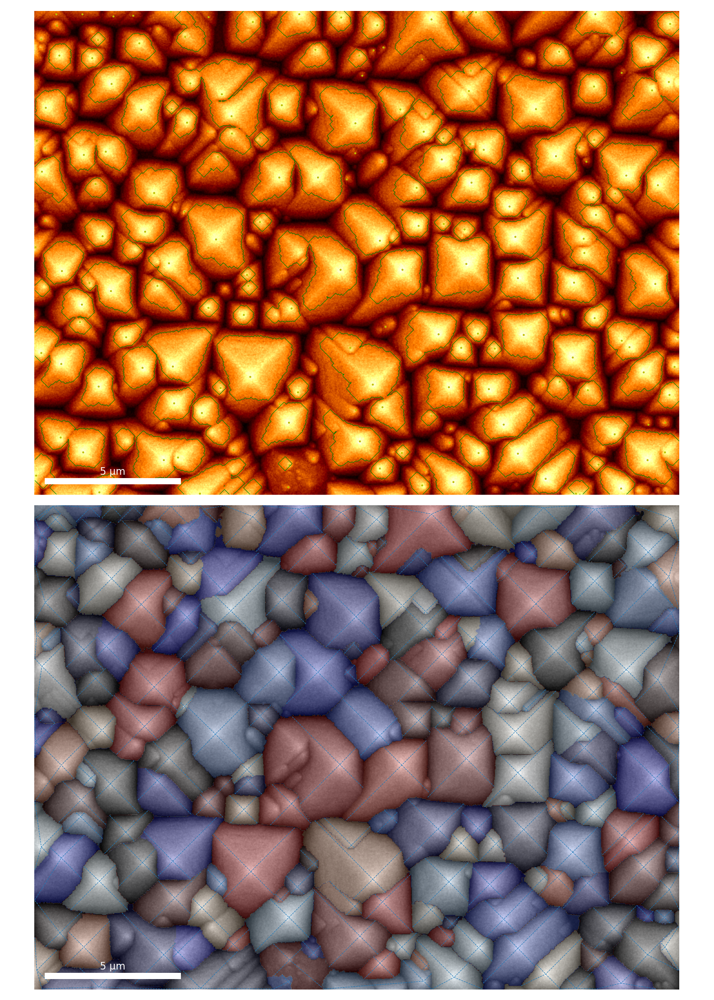

# Pyramids repo
Python scripts to segment SEM images of pyramid facets in silicon and measure some properties. The basic functionality is explained in the `find_pyramids.ipynb` Jupyter notebook. The notebook can be executed using an online Jupyter dashboard, provided by `binder`. To access this, use the button below.

